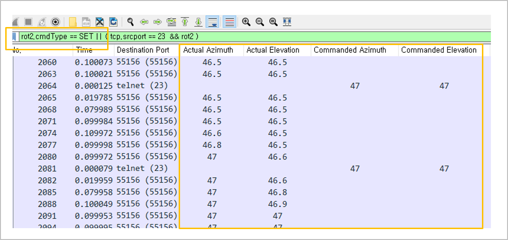

We share some lua scripts that works as msg dissector to display clearly your data in wireshark.  
You can achive the following!


## Editor
Visual Studio Code
## Insatll lua script 
1. In the Administrator Mode CMD window, run the following command. In the [LUA script file name] section, replace the LUA script file name you want to copy.
```
copy /Y ".\[LUA script file name].lua" "C:\Program Files\Wireshark\plugins\[LUA script file name].lua"
```
2. It is automatically reflected when you run Wireshark.  
3. If Wireshark is running, it will be applied dynamically when Ctrl+Shift+L is entered.  
## Contact
email - jsing@contec.kr   
homepage - http://www.contec.kr/

  
"I will sing to the LORD, for he has been good to me" <Psalms 13:6> 
