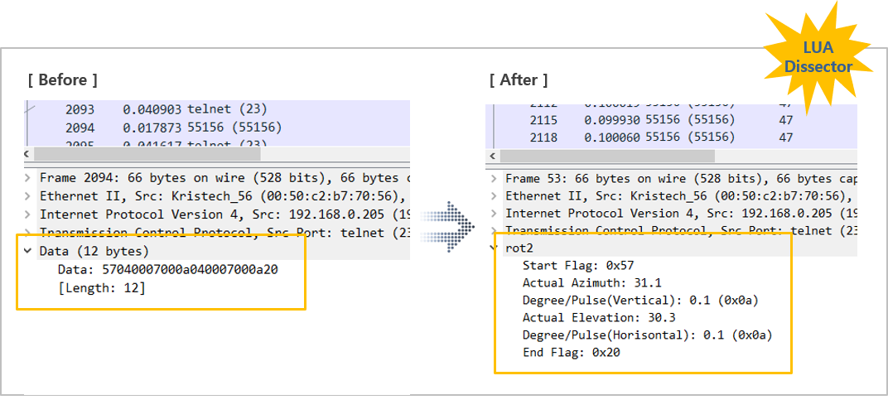

[](https://hits.seeyoufarm.com)

## Overview
We share some lua scripts that are applied to our business field (satellite ground station). It works as a message dissector in Wireshark. It is helpful when you analyze your own application protocol data. You just have to see your automatically dissected and decoded each data field. and you can also filter your own protocol data field. It will make you very efficient in debuging time. 




## Editor
Visual Studio Code
## Insatll lua script 
1. In the Administrator Mode CMD window, run the following command. In the [LUA script file name] section, replace the LUA script file name you want to copy.
```
copy /Y ".\[LUA script file name].lua" "C:\Program Files\Wireshark\plugins\[LUA script file name].lua"
```
2. It is automatically reflected when you run Wireshark.  
3. If Wireshark is running, it will be applied dynamically when Ctrl+Shift+L is entered.  
## Contact
email - joosing711@gmail.com 
